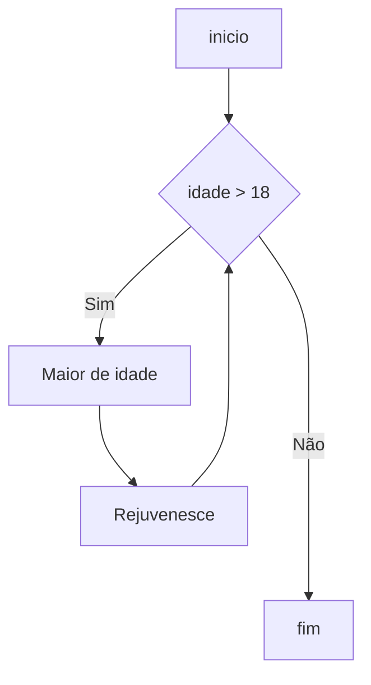

# [Fe] Ferrugem vs 0.1

Portugol sendo reescrito em Rust

[forked from https://gitlab.com/codescope-reference/cii](https://gitlab.com/codescope-reference/cii)

👨‍🎤 *Não esqueça de instalar a extensão disponível no [link](https://github.com/ricardodarocha/suporte-ferrugem/tree/main)*

## Origem do nome

Ferrugem é a tradução para o português da palavra Rust, linguagem na qual este projeto foi escrito.
O símbolo [Fe] também é o símbolo do elemento Ferro.
O número do elemento [Fe] 26 também é o número de letras do alfabeto da língua portuguesa

## Inspirações

Este projeto é inspirado na primeira definição da linguagem Portugol, usada para ensinar programação e criada pelo professor Antonio Carlos Nicolodi entre 1980 e 1983

## Teste agora
download do executável na pasta bin (windows)
1. descompacte o arquivo zip em uma pasta
2. adicione esta pasta às variáveis de ambiente, se deseja acessar o programa de qualquer lugar
3. usando o cmd, chame o comando ">fe programa.fe". O programa ferrugem vai tentar interpretar o script portugol contido no arquivo

Caso tenha alguma dúvida, cheque a página de sintaxe.md ⚠ em construção 

## História
A linguagem Portugol teve forte influência de Pascal, mas mantém a sintaxe mais simples, uma característica importante para quem está aprendendo programação ou que está tendo contato com algoritmos pela primeira vez. Atualmente existem outras versões da linguagem Portugol, algumas consideradas pseudocódigo, e outras são linguagens completas, livres de contexto, com gramáticas definidas e implementações em editores ou compiladores. [Fonte: https://pt.wikipedia.org/wiki/Portugol](https://pt.wikipedia.org/wiki/Portugol)

Quem tiver interessem em desenvolvimento de linguagens pode acessar o livro https://craftinginterpreters.com/

A implementação deste projeto foi inspirado pela série do youtube
https://www.youtube.com/watch?v=Pn5RW9qFQW4&list

## Suporte a documentação

Os códigos geram documentação no formato mermaid.js  
Ver o arquivo .doc que é gerado a cada execução do programa.

Acesse a doc [mermaid.js](https://mermaid.js.org/syntax/flowchart.html) para saber mais

*Exemplo de um fluxo de decisão gerado pelo [Fe]*

## Contribuições

Contribuições são bem vindas, basta enviar um pull request ou enviar um e-mail para ricardodarocha@outlook.com

## Roadmap

Rust permite implementar uma série de novos recursos que a linguagem Portugol originalmente não tinha. Alguns exemplos já implementados são classes, funções anônimas, processos encadeados entre outros.

Alguns recursos ainda carecem de testes

|   |   |
|---|---|
| Olá mundo  | ✅ |
| saída  | ✅ |
| entrada  | ❌ parcialmente |
| prompt  | ✅  |
| arquivo.fe | ✅  |
| fluxo de decisão  | ✅ |
| laço  | ✅ |
| enquanto  | ✅ |
| aritmética básica  | ✅ |
| operações lógicas  | ✅ |
| geração de documentaçao  | ✅ |
| acentuação  | ❌ |
| suporte a unicode  | ❌ |
| métodos anônimos  | ✅ |
| funções  | ✅ |
| chamadas encadeadas  | ✅ |
| concatenação de strings  | ✅ |
| concatenação de strings com números  | ✅ |
| formatar a saída  | ❌ |
| consultar a data e hora do sistema  | ✅ |
| variáveis do tipo data | ❌  |
| classes | ✅  |
| propriedades | ✅  |
| métodos | ✅  |
| herança | ✅  |
| self | ✅  |
| super | ✅  |
| limpar a tela | ✅  |

> **Atenção**
> Este projeto é inteiramente experimental com fins educativos. Vários recursos ainda precisam ser testados e ajustados. Contribuições são bem vindas. Atente ao roadmap. Use o github issues para criar solicitações de ajustes e o fórum para debater as prioridades.

## Agradecimentos

Agradecimentos a
[CodeScope](https://www.youtube.com/@codescope6903)

Este projeto foi inspirado pela série do youtube
https://www.youtube.com/watch?v=Pn5RW9qFQW4&list
